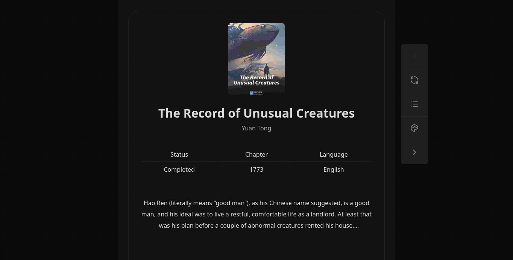

# Dragoid

A tool for downloading web novels online for offline reading in various formats.

## Requirements

- Node.js v22.13.1 or higher.

## Installation

```bash
npm install -g dragoid
```

## Usage

```bash
dragoid <command> [options]
```

To view general help:

```bash
dragoid --help
```

To view the installed version:

```bash
dragoid --version
```

## Examples

### Download:

Download the first 5 chapters of a novel in EPUB:

```bash
dragoid download \
  --mode=novel \
  --url="https://site.com/my-novel" \
  --format=epub \
  --limit=5
```

Before downloading, check if the site is supported using:

```bash
dragoid download --list-crawlers
```

List supported output formats:

```bash
dragoid download --list-output-formats
```

Download a specific chapter:

```bash
dragoid download \
  --mode=chapter \
  --url="https://site.com/my-novel/cap-10" \
  --format=json \
  --path="./downloads"
```

For more information about the download command, <a href="./docs/command-download.md">click here</a>.

### Starting the web reader

Starts a local server with a web reader to preview downloaded novel files in `JSON` format.

```bash
dragoid preview \
  --file="./my-novel.json" \
  --public
```



For more information about the preview command, <a href="./docs/command-preview.md">click here</a>.

## Supported Download Formats

| Type | JSON | EPUB | TXT |
| --- | --- | --- | --- |
| Novel | ✅ | ✅ | ❌ |
| Chapter | ✅ | - | ❌ |